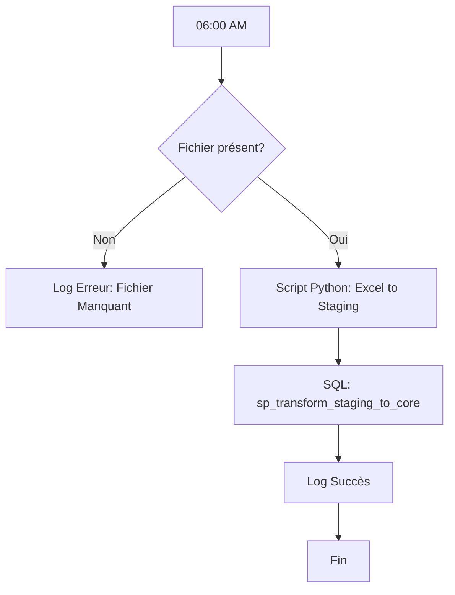

# Epic 03 : Automatisation du Pipeline (Pipeline & Scheduling)

Cet Epic vise à rendre le système autonome. Le pipeline doit être capable de récupérer le fichier chaque matin à 06h00, de l'importer dans PostgreSQL et de déclencher les transformations de l'Epic 02.

## [TASK-08] Ingestion Automatisée (Python / SQL)
**Problématique** : PostgreSQL ne peut pas lire nativement des fichiers `.xlsx`. Le fichier doit être converti en CSV ou lu par un script intermédiaire.

**Solution technique** : Un script Python `ingest_orders.py`.
- **Bibliothèques** : `pandas`, `openpyxl`, `psycopg2`.
- **Rôle** :
    1. Lire le fichier Excel.
    2. Nettoyer les colonnes pour correspondre à la table `staging_orders`.
    3. Utiliser la commande `COPY` de PostgreSQL (via un buffer) pour une insertion ultra-rapide.
    4. Vider la table `staging_orders` avant chaque import (`TRUNCATE`).

---

## [TASK-09] Orchestration & Scheduling
**Objectif** : Exécuter le pipeline tous les jours à 06h00.

**Solution technique (Windows)** : **Windows Task Scheduler**.
1. Créer un fichier batch `run_pipeline.bat` qui :
    - Active l'environnement Python.
    - Exécute `ingest_orders.py`.
    - Appelle la procédure stockée `CALL sp_transform_staging_to_core();`.
2. Configurer une tâche planifiée Windows pour lancer ce `.bat` quotidiennement.

---

## [TASK-10] Journalisation (Logging)
**Objectif** : Garder une trace de chaque exécution et identifier les erreurs.

**Actions à réaliser :**
1. Créer une table `pipeline_logs` :
```sql
CREATE TABLE pipeline_logs (
    log_id SERIAL PRIMARY KEY,
    execution_date TIMESTAMP DEFAULT CURRENT_TIMESTAMP,
    status VARCHAR(20), -- 'SUCCESS', 'FAILURE'
    rows_processed INT,
    error_message TEXT
);
```
2. Mettre à jour la procédure stockée pour insérer une ligne dans cette table à la fin de chaque traitement.

---

## Flux de Travail (Workflow) Global


## Livrables de l'Epic 03
1. **Script d'ingestion** : `ingest_orders.py`.
2. **Script de lancement** : `run_pipeline.bat`.
3. **Table de logs** : Script DDL pour `pipeline_logs`.
